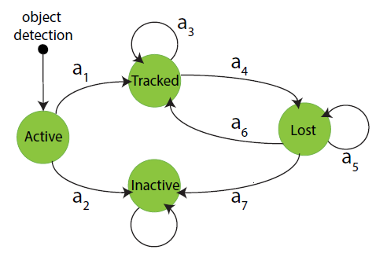
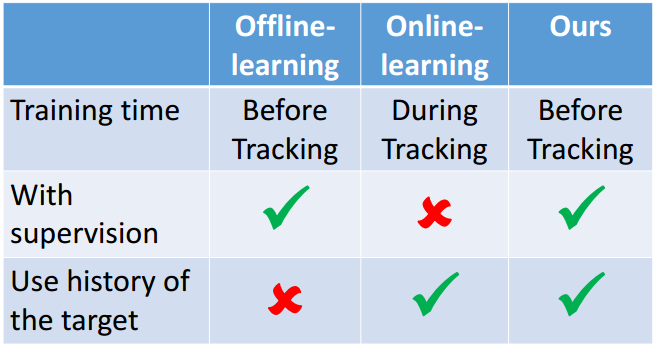

# Learning to Track: Online Multi-Object Tracking by Decision Making
|               | Learning to Track: Online Multi-Object Tracking by Decision Making |
| ------------- | -------------            |
| Writer | Yu Xiang, Alexandre Alahi, Silvio Savarese, Stanford University |
| Publication | ICCV 2015 |
| Citation | 28 until 20170208   |
| Reading Time | Feb 15th, 2017       |
| Field | Online Multi-Object Tracking, Tracking by Detection |  
| Challenge | Data association under occlusion and noisy detections |
| Contributions | Utilize Decision Making for MOT(MDPS)|

-----------------------------
# 论文摘要
在线多目标追踪在time-critical 的视频分析场景中有着广泛的应用，例如：机器人导航以及自动驾驶。在通过检测来进行追踪(tracking-by-detection)的思路方面，在线多目标追踪的一个主要挑战就是怎样健壮性地将新帧中的噪声对象检测与先前被追踪的对象联系起来。在我们的论文中，我们将在线多目标追踪问题视为马尔科夫决策过程(MDPs-Markov Decision Processes)中的决策制定，其中一个目标物体的寿命通过MDP进行建模。学习数据关联的相似性函数等同于学习MDP中的决策(policy)。同时，policy learning 接近于强化学习，它可以同时利用offline-learning 和 online-learning的优势。此外，通过使用现有的在线单一目标追踪的方法，将目标是做MDP中的状态转换，我们的框架能够自然地处理目标的birht/death 和appearance/disappearance。我们在MOT Benchmark上去验证了我们方法的高效性。

-------------
# 总体思路
 framework.PNG)    
图为将online MOT视作是MDP中决策问题的框架。    
从图中可以看到，将多目标追踪转换为单一目标追踪，根据其是否在帧中呈现将其划分状态。

    
图为MDP在论文中使用的结构。    
可见，首先将多目标追踪问题转变为了多个单目标追踪问题，然后每个单目标都仅有四种状态。初始时任何目标都是Active的状态，...(很明显), 最后的状态都是Inactive。如果Lost经过一个较长的时间t那么该目标也会进入非激活状态。

-----------
# 附录
## offline-learning 和 online-learning
    

由图中我们可以看到，offline-learning是得到的一种静态数据集，能够很好地获取视频中的所有目标信息并为其进行标记，但是其不能够记录目标的历史信息; online-learning 可以记录目标的历史信息，但是由于其在线性，不可能很好地根据数据标签分类，进行监督。    
***视频中的离线学习难道不是一帧一帧地进行训练，为何会存在不能够使用先前历史信息的问题？思考其离线学习的机器学习是如何进行实现的？***    
在这篇论文中，使用强化学习可以很好地利用offline-learning可以在跟踪之前进行训练的优势，以及online-learning可以使用目标的历史的特性进行更好地训练。

